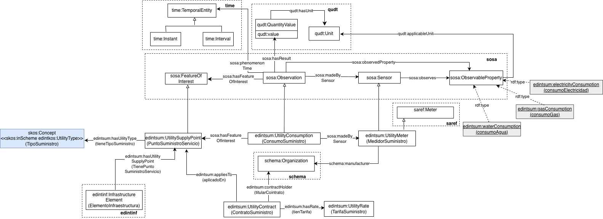

# Ontología de Suministro (Utility ontology)

La ontología de Suministro representa los datos relacionados con los servicios suministrados a los elementos de la infraestructura de un municipio y la medición de su consumo. 

# Propósito y alcance de la ontología (Purpose and scope of the ontology)

El propósito de esta ontología es el de proporcionar un vocabulario común para la representación de las entidades y datos principales de los servicios suministrados a los elementos de la infraestructura de un municipio y la medición de su consumo. Su alcance es el de suministros como electricidad, gas, agua, entre otros. La infraestructura de un municipio puede incluir todos los elementos de la infraestructura tales como centros educativos, centros culturales y sociales, centros de salud, aparcamientos así como todos los elementos urbanos. Su alcance cubre los datos que pueden ser utilizados con los propósitos de conocer y gestionar el consumo de recursos por el municipio  que es parte de las funciones habituales de las entidades locales.

# Prefijo y espacio de nombres (Prefix and namespace)
El prefijo de la ontología de Suministro es: edintsum y es publicada en el espacio de nombres: [http://vocab.linkeddata.es/datosabiertos/def/urbanismo-infraestructuras/suministro#](http://vocab.linkeddata.es/datosabiertos/def/urbanismo-infraestructuras/suministro#) 

# Modelo conceptual (Ontology conceptualization)

# Estructura del repositorio (Repository structure)

El repositorio contiene los siguientes directorios:

| Folder | Description |
|--------|--------------|
| **diagrams/** | Stores diagrams and other resources representing the conceptual model of the ontology (e.g., class hierarchies, relationships). |
| **documentation/** | Stores the HTML or human oriented documentation of the ontology and related artefacts. |
| **examples/** | Includes examples that demonstrate how to instantiate or apply the ontology in real data scenarios. |
| **kos/** | Stores controlled vocabularies or KOS implementation, usually SKOS implementations in rdf. |
| **ontology/** | Contains the actual ontology implementation files in formats such as `.owl`, `.rdf`, `.ttl`, or `.jsonld`. |
| **requirements/** | Contains all documents used to define the ontology’s requirements: data example, competency questions, functional requirements, use cases, etc. |
| **shapes/** | Contains the SHACL shapes used to define and validate ontology constraints. |

# Mantenimiento y evolución (Maintenance and evolution)

Para manejar las incidencias o mejoras sugeridas con respecto a la ontología, recomendamos seguir las guía proporcionadas en ([Issues Management](https://github.com/telefonicasc/edint-ontologia-suministro/issues)) para generar una incidencia (trabajo en progreso).

# Financiación (Funding)

Esta ontología ha sido desarrollada en el contexto del Espacio de Datos para las Infraestructuras Urbanas Inteligentes ([EDINT](https://edint.es/)). 

